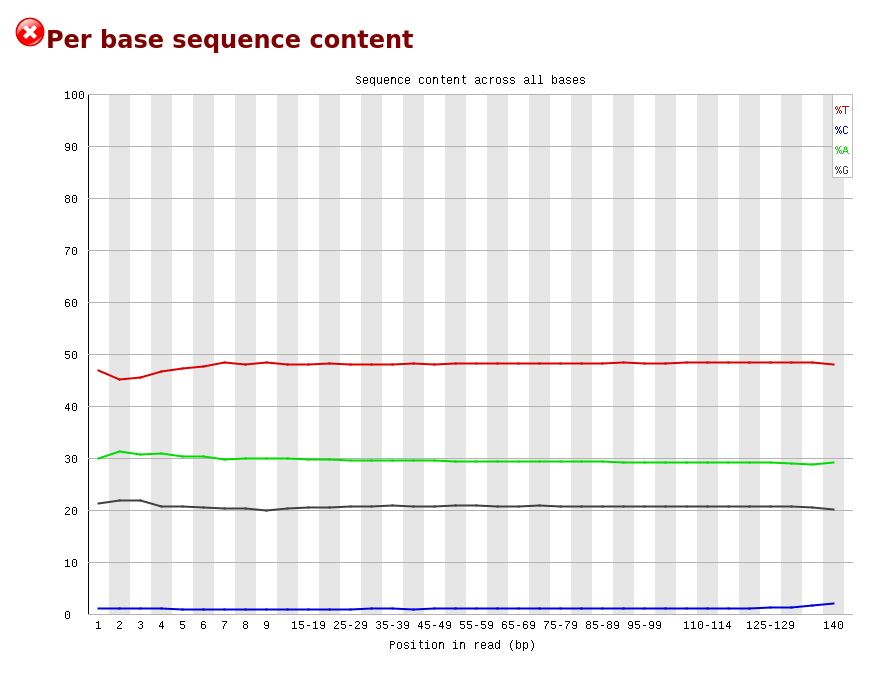
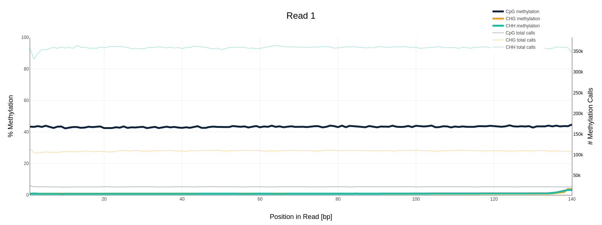
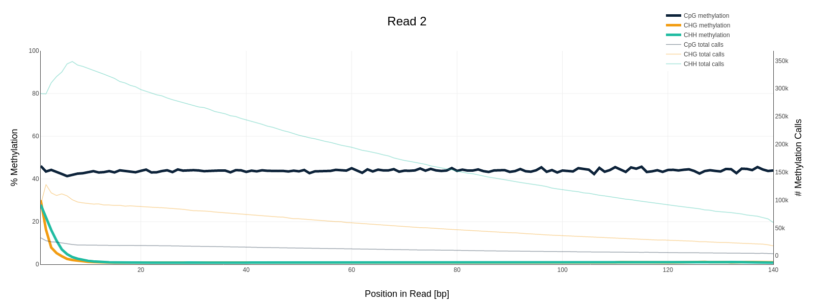
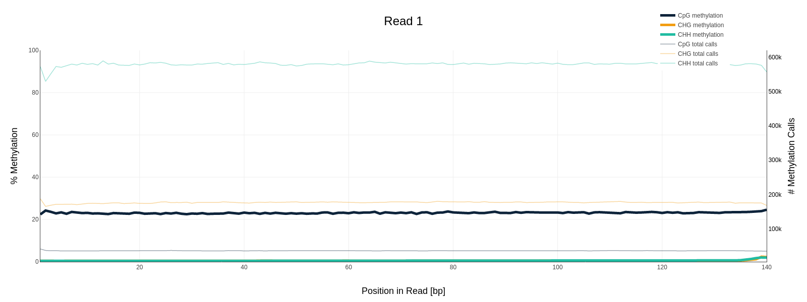
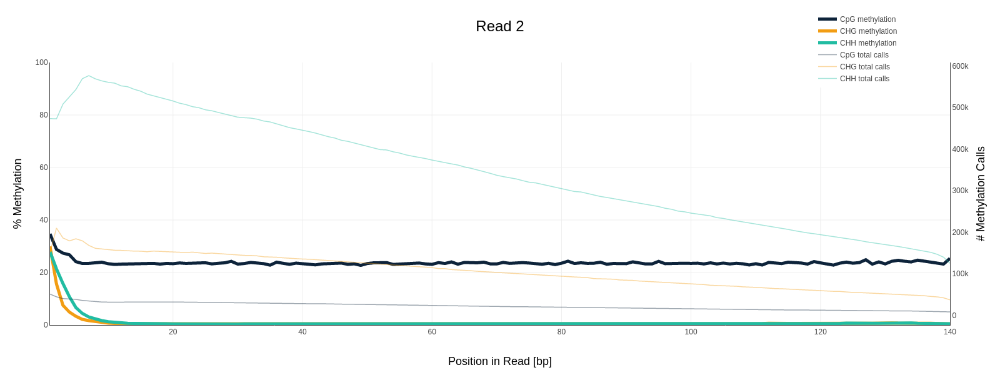
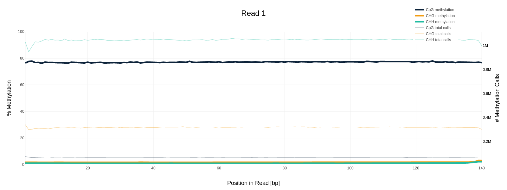
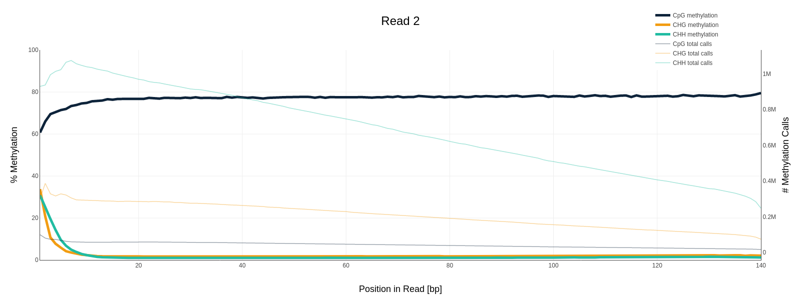
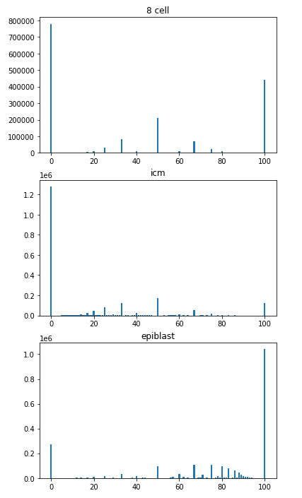
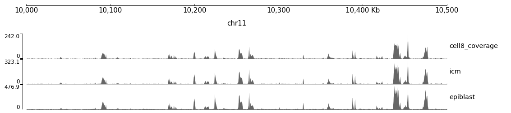
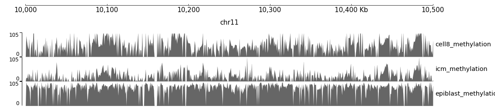

# hse_hw1_meth

[Colab](https://colab.research.google.com/drive/1EZ97QcglRcoQ95gCRBXH4FJ1pOhirZjl)

## Анализ качества чтений

Качество достаточно хорошее, адаптеров нет (по сравнению с обычным секвенированием ДНК)

Цитозина очень мало, тимина больше, чем в обычном DNA-seq (при обработке бисульфитом неметилированный цитозин заменяется на урацил->тимин)

## Работа с данными о метилировании

### Покрытие участков ридами

| Образец  | 11347700-11367700 | 40185800-40195800 |
|----------|-------------------|-------------------|
| 8-cell   | 1090              | 464               |
| ICM      | 1456              | 630               |
| epiblast | 2328              | 1062              |

### Процент дуплицированных чтений

| Образец  | Дуплицировано |
|----------|---------------|
| 8-cell   |   18.31%      |
| icm      |   9.08%       |
| epiblast |   2.92%       |

### M-bias графики

| Образец  | Read 1                        | Read 2                        |
|----------|-------------------------------|-------------------------------|
| 8-cell   |     |     |
| ICM      |       |       |
| epiblast |  |  |

### Гистограммы распределения метилирования

Графики похожи на приведённые в статье. В ICM большая часть цитозина не метилирована, на стадии эпибласта, наоборот, высокий уровень метилирования. В образце из 8-клеточного эмбриона распределение ближе к равномерному.

### Графики покрытия и метилирования

Выбранный регион - `chr11:10'000'000-10'500'000`

Уровень покрытия чтениями

Уровень метилирования

